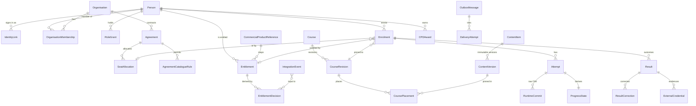

# 03 — Data model and tenant/role threat model

Status: **Draft for review.** This is a logical model. The physical schema is finalised in S1–S2 migrations and may add columns, but it **must keep the distinctions below** (brief §6).

## 1. Distinctions the model guarantees

| Distinction | How it's kept |
|---|---|
| Identity ≠ entitlement ≠ enrolment ≠ progress ≠ result ≠ credential | Separate tables with separate lifecycles. An enrolment *references* the entitlement or seat that justifies it. Progress belongs to an attempt. A result belongs to an assessment attempt or an enrolment outcome. A credential references a result. |
| ContentItem ≠ ContentVersion ≠ CoursePlacement | A ContentItem is the reusable identity. A ContentVersion is an **immutable** package build (content hash). A placement puts a ContentItem, pinned to a ContentVersion, into a CourseRevision. |
| Purchase proof ≠ access decision | `integration_event` (proof received) → `entitlement_decision` (rule applied) → `entitlement` (current access). A browser redirect never writes any of these. |
| Organisation scope | `organisation_id` (the licensing context) is NOT NULL on every client-owned row, and RLS applies (ADR-0004). |
| Raw evidence vs corrections | Raw SCORM commits and assessment responses are **append-only**. Corrections are separate rows that reference the original, and are audited. |

## 2. Entity catalogue

Tenancy classes: **G** = global and TCGI-owned. **P** = person-global (visible to an org only via membership). **T** = tenant-scoped (`organisation_id` NOT NULL, RLS). **S** = system or integration (platform capability only).

| Entity | Class | Key fields (logical) | Invariants |
|---|---|---|---|
| **Person** (the brief's "Learner") | P | id (UUID), display_name, primary_email, email_verified, status (active, suspended, deactivated), created_at | No lookup by email at sign-in. PII kept to the minimum needed. |
| **IdentityLink** | P | person_id, issuer, subject, linked_at, linked_via (login, invite, migration, support), last_login_at | UNIQUE(issuer, subject). A person may have more than one link (for example after an IdP migration). Unlinking is audited. |
| **Invitation** | T | organisation_id, person_id (pre-created), token_hash, expires_at, accepted_at | Single use. The token is stored only as a hash. |
| **Organisation** | G/T root | id, kind (tcgi_direct, enterprise, later partner), name, branding_ref, status | One `tcgi_direct` org for B2C. |
| **OrganisationMembership** | T | organisation_id, person_id, status, start/end, source | UNIQUE active (org, person). |
| **RoleGrant** | T or platform | person_id, role, scope_type, scope_id, valid_from/to, granted_by, reason | Only a holder of `role.grant` for that scope can grant it. Always audited. |
| **Agreement** (enterprise contract) | T | organisation_id, external_contract_ref, seat_limit, access_start/end, reassignment_rule_ref, status | The values come from DEC-12. **Nothing is invented.** Versioned: changes create a new agreement revision. |
| **AgreementCatalogueRule** | T | agreement_id, course_id or path_id or tag filter | Defines the allowed catalogue (ENT-01). |
| **SeatAllocation** | T | agreement_id, person_id, state (allocated, released, reassigned), allocated_at/by, released_at/by, reason | The count of active allocations ≤ seat_limit, enforced transactionally. History is never deleted. |
| **CommercialProductReference** | G | source (for example `woocommerce`), external_product_id, external_variant_id, maps_to (course_id or path_id), access_duration_rule_ref, active | A mapping table only. No price is stored (commerce owns price). |
| **Entitlement** | T | organisation_id (tcgi_direct for B2C), person_id, grant_type (commerce_line, seat, manual), source_ref (source, order_id, line_id), product_ref_id, status (pending, active, suspended, revoked, expired), valid_from, valid_until, derived_from_decision_id | For commerce, UNIQUE(source, order_id, line_id). Its state is **derived** (ADR-0006). |
| **EntitlementDecision** | T | entitlement_id, input_event_ids[], rule_version, before, after, decided_at | Append-only. |
| **ContentItem** | G | id, stable_key, title, owner, tags, accessibility_meta | The unit of reuse is decided by DEC-04. |
| **ContentVersion** | G | content_item_id, version_no, package_hash (SHA-256), scorm_version (1.2 or 2004 edition), manifest_json, storage_key, status (draft, approved, retired), created_by | **Immutable** once approved. UNIQUE(content_item_id, version_no) and UNIQUE(package_hash). |
| **Course** | G | id, slug, tier (microlesson, foundation, professional_certificate, advanced_certificate, diploma), status | Tier values come from CAT-03. |
| **CourseRevision** | G | course_id, revision_no, state (draft, in_review, approved, published, retired), completion_rule_ref, approved_by, published_at | Immutable once published (CAT-05). |
| **CoursePlacement** | G | course_revision_id, content_item_id, content_version_id, position, required, prerequisite_placement_ids | One ContentVersion can appear in many courses with **one** stored object. |
| **LearningPath / PathRevision / PathStep** | G | the same revision pattern. Steps reference courses | — |
| **Cohort** | T | organisation_id, course_id, course_revision_id, start/end, name | — |
| **Enrolment** | T | organisation_id, person_id, course_id, **course_revision_id (pinned)**, entitlement_id or seat_allocation_id, cohort_id, status (active, completed, expired, withdrawn), access_start/end, completed_at | It must reference a justifying entitlement or seat. Changing the pinned revision is an audited action (CAT-05). |
| **AccessException** | T | enrolment_id, kind (extension, early_access, reinstatement), old/new values, reason, actor, approved_by | LRN-03. |
| **Attempt** (SCORM registration) | T | organisation_id, enrolment_id, placement_id, content_version_id, attempt_no, runtime_provider, runtime_registration_ref, started_at, ended_at | UNIQUE(enrolment_id, placement_id, attempt_no). |
| **RuntimeCommit** (raw CMI) | T | attempt_id, seq, received_at, cmi_payload (jsonb), payload_hash, client_meta | **Append-only.** This is the raw evidence (LRN-01). |
| **ProgressState** | T | attempt_id, completion_status, success_status, score_raw/min/max/scaled, location, suspend_data, total_time, last_commit_seq, source (client_reported, migrated) | Derived from RuntimeCommit. It can be rebuilt. |
| **Assessment / Question / QuestionPoolVersion** | G | id, rule_ref (DEC-16), pass_mark, attempt_limit, randomisation_rule, versioned | **No rule values until DEC-16.** |
| **AssessmentAttempt / Response** | T | organisation_id, enrolment_id, assessment_version_id, drawn_question_ids, responses, submitted_at, scored_by_version | Append-only responses. Scoring is server-side for summative assessments (DEC-15). |
| **Result** | T | organisation_id, enrolment_id, assessment_id or course outcome, outcome (pass, fail, withheld, pending_moderation), score, classification (per DEC-16), finalised_at, finalised_by | A finalised result changes only through a ResultCorrection. |
| **ResultCorrection** | T | result_id, old/new, reason, actor, approval_id, approved_by | OPS-03. |
| **CPDAward** | T | organisation_id, person_id, source_type, source_id (for example a completion), credit_amount, unit, awarded_at | **UNIQUE(source_type, source_id)**, which prevents duplicate awards (LRN-05). The rule is DEC-22. |
| **ExternalCredential** | T | organisation_id, person_id, result_id, provider (`accredible`), state (requested, issued, revoked, failed), external_id, url, acknowledged_at | Shown as "issued" **only** after the provider acknowledges it (LRN-06). |
| **IntegrationEvent** | S | direction (in, out), source or destination, event_type, schema_version, idempotency_key, payload (jsonb), payload_hash, signature_valid, received_at, processed_at, status, error | UNIQUE(source, idempotency_key) for inbound. |
| **OutboxMessage / DeliveryAttempt** | S | outbox: event_id, aggregate_type/id, aggregate_seq, destination, payload, status, next_attempt_at, attempts. Attempt: http_status, response_excerpt (no PII), duration, error | Ordered per aggregate. |
| **AuditEntry** | T or platform | id, occurred_at, actor_person_id or service principal, actor_grant_id, organisation_id (nullable only for platform actions), action, entity_type/id, before/after (redacted), reason, request_id, prev_hash | Append-only (DB grants plus trigger). An optional hash chain gives tamper-evidence. |

## 3. Entity-relationship overview

## 4. Content versioning rules (CAT-02, CAT-04, CAT-05)

1. Uploading a package always creates a new ContentVersion. An identical hash is rejected as a duplicate and the existing version is reused.
2. Placements pin a ContentVersion. Publishing a new CourseRevision doesn't move existing enrolments. Moving a cohort is an explicit admin action, with a preview of the effect on in-progress attempts and an audit entry. Its policy comes from DEC-19.
3. **SCORM suspend data is only safe to resume against the same ContentVersion.** Moving a learner mid-attempt to a new version starts a new attempt unless DEC-19 approves otherwise. This constraint also shapes migration (06).
4. Credit transfer for a shared lesson across courses follows DEC-19. Until then, the default is **no automatic transfer**, with prior completion *shown* but not counted.

## 5. Threat model: tenant and role boundaries

Method: STRIDE over the trust boundaries below, with OWASP ASVS as the control baseline.

**Trust boundaries**
- (B1) Browser ↔ app origin
- (B2) Browser ↔ content origin, running untrusted package JS
- (B3) miniOrange ↔ LMS
- (B4) Commerce producer ↔ LMS inbox
- (B5) LMS outbox ↔ HubSpot and Accredible
- (B6) App ↔ database
- (B7) Staff and support ↔ admin functions
- (B8) Contractor and CI ↔ cloud accounts

**Assets:** learner PII, enterprise rosters and reports, academic results and CPD, entitlements (monetary value), SCORM packages (TCGI IP), audit trail, integration secrets.

| # | Threat (STRIDE) | Boundary | Scenario | Controls | Verified by |
|---|---|---|---|---|---|
| T-01 | Info disclosure (IDOR) | B1 | An Org A manager changes `/orgs/{B}/learners` or `/enrolments/{id}` to reach B's data | The org context is derived server-side from RoleGrant. Scoped repository returns 404. RLS. UUIDs are not treated as a security control | TS-SEC matrix plus direct-SQL RLS test |
| T-02 | Elevation | B1 | A client sends `organisation_id` or `role` in the body to act in another org | Body fields for scope are ignored or rejected. The route declares its scope source. A route inventory test | TS-SEC |
| T-03 | Info disclosure | B1 | An enterprise manager sees an employee's personal B2C enrolments | Reports filter by enrolment `organisation_id` = the manager's org, never by person | TS-SEC "dual-context learner" fixture |
| T-04 | Info disclosure | B1 | Enumeration via search, autocomplete, counts, error messages or timing | Search is scoped. Uniform 404. Rate limits. No cross-tenant totals | TS-SEC |
| T-05 | Info disclosure | B1 | Export or transcript URLs are shared or guessed | Short-lived signed URLs, generated after the policy check. Downloads audited | TS-SEC |
| T-06 | Tampering | B1 | CSV formula injection in exports (`=HYPERLINK(...)` in a name) | Escape leading `= + - @` and tab/CR in CSV cells | Unit plus TS-SEC |
| T-07 | Spoofing | B3 | A forged or replayed SAML assertion or ID token, XML signature wrapping, `alg` confusion, wrong audience | A vetted library with strict settings (ADR-0005). Replay cache. Audience, issuer and nonce checks | TS-SEC negative auth suite |
| T-08 | Spoofing (account takeover) | B3 | A new IdP account with the same email claims a migrated learner | Never link on email. Signed invite token. An email match triggers a support review | TS-E2E, ID-03 tests |
| T-09 | Info disclosure / elevation | B2 | Malicious or compromised package JS steals the session or calls admin APIs | A separate content origin. No app cookies there. A launch token scoped to one attempt, CMI read/write only. CSP and `frame-ancestors` | TS-SEC: a "hostile package" fixture tries to fetch app APIs |
| T-10 | Tampering | B2 | The learner edits their launch token to write another attempt's CMI | The token is bound server-side to (person, attempt). Signed, short TTL. The attempt ID comes from the token, not the URL | TS-SEC |
| T-11 | Tampering (academic) | B2 | The learner calls `SetValue("cmi.score.raw","100")` from devtools | CMI is stored as `client_reported`. Summative diploma results use server-scored assessments (DEC-15). Anomaly flags (for example completion time under a threshold) for review | TS-ACAD, TS-SEC |
| T-12 | Spoofing / tampering | B4 | A forged, altered or replayed commerce event grants access | HMAC-SHA256 over timestamp plus body, per-source secret, ±5 min window, idempotency key, key rotation | TS-EVT |
| T-13 | Repudiation / integrity | B4 | Out-of-order refund processed before purchase, which wrongly grants access | Derived fold over all events (ADR-0006) | TS-EVT property tests |
| T-14 | Info disclosure | B5 | Excess PII sent to HubSpot or Accredible, or secrets leaked in logs | Field allow-list per destination (DEC-08, DEC-24). No PII in logs. Secrets only in the secrets manager | Contract tests, log scanning |
| T-15 | Elevation | B6 | The app connects as the table owner or with `BYPASSRLS`, which silently disables RLS | Separate DB roles. CI check that the app role has no `BYPASSRLS` and doesn't own the tables | Migration test |
| T-16 | Elevation (insider) | B7 | A support agent browses any learner's data or silently edits results | Restricted `tcgi_support` capability set. Reads of learner detail audited. Corrections need a reason and, where policy requires, approval by a second person | TS-SEC, OPS-03 tests |
| T-17 | Repudiation | B7 | An admin alters history or deletes audit rows | Audit and raw tables are append-only via DB grants. Optional hash chain. Audit exported to separate storage | DB tests |
| T-18 | Elevation / supply chain | B8 | Contractor credentials or the CI pipeline compromised and prod altered | OIDC-federated CI with no long-lived keys. Protected branches with required review. Prod deploy approval by a TCGI owner. Dependency, secret and container scanning | Pipeline config review |
| T-19 | DoS | B1/B2/B4 | Commit or event flood, or zip bombs in package upload | Rate limits per token and source. Upload size and decompression-ratio limits. Uploads processed in a sandboxed worker | Unit plus load tests |
| T-20 | Info disclosure | B1 | Package upload used for stored XSS on the app origin | Packages served only from the content origin. Content type sniffing disabled. Upload restricted to `content.upload` capability | TS-SEC |

Residual risks for acceptance: T-11 (inherent to SCORM; mitigated by DEC-15), and T-18 (depends on contractor practices; mitigated by TCGI owning the accounts and approving deploys).
